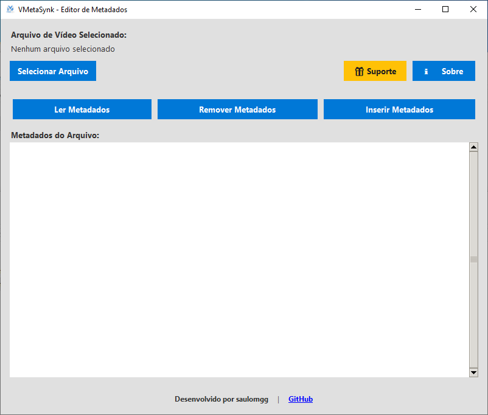

# 🎬 MetaSynk - Editor Profissional de Metadados de Vídeo

O **MetaSynk** é uma ferramenta profissional de manipulação de metadados de vídeo, desenvolvida para ser rápida, modular e segura. Como parte integrante do ecossistema **HubSynk**, ela oferece uma interface moderna e intuitiva para gerenciar as informações dos seus arquivos de mídia com total privacidade.



## 🚀 Funcionalidades Principais

*   **🔍 Leitura Detalhada**: Visualize instantaneamente todos os metadados técnicos, informações de formato e tags de cada stream (vídeo, áudio e legendas).
*   **🧹 Limpeza Total**: Remova todos os metadados e tags dos seus arquivos para garantir privacidade absoluta ou padronização de biblioteca.
*   **✍️ Edição Personalizada**: Insira ou atualize campos essenciais como Título, Autor (Artista), Ano, Gênero e Comentários diretamente no arquivo.
*   **⚡ Processamento Local**: Todo o trabalho é realizado localmente usando o motor FFmpeg, sem uploads para a nuvem e sem perda de qualidade original.
*   **🎨 Interface Moderna**: Tema Dark otimizado para produtividade, com foco na experiência do usuário e facilidade de navegação.
*   **🔗 Integração HubSynk**: Totalmente compatível com o ecossistema de ferramentas oficiais e verificação de integridade.

## 🛠️ Como Utilizar

*   **Selecionar**: Clique em **Selecionar Arquivo** para carregar o seu vídeo (MP4, MKV, AVI, MOV, etc.).
*   **Analisar**: Use o botão **Ler Metadados** para ver a estrutura interna atual do arquivo.
*   **Processar**: 
    *   Para limpar: Clique em **Remover Metadados** e escolha o local de salvamento.
    *   Para editar: Clique em **Inserir Metadados**, preencha os campos desejados e clique em **Aplicar**.
*   **Concluir**: O MetaSynk gerará um novo arquivo com as alterações aplicadas, mantendo o original intacto.

## 📁 Arquitetura do Projeto

O projeto segue uma estrutura modular para facilitar a manutenção e escalabilidade:

```text
metasynk/
├── main.py              # Ponto de entrada da aplicação
├── src/
│   ├── ui/              # Interface gráfica (Tkinter/Custom Styles)
│   │   └── main_window.py
│   └── utils/           # Lógica de processamento e helpers
│       ├── video_processor.py
│       └── helpers.py
├── assets/              # Ícones, logos e capturas de tela
└── wiki/                # Documentação técnica detalhada
```

## ⚙️ Pré-requisitos

Para executar o MetaSynk a partir do código fonte, você precisará:

1.  Ter o **FFmpeg** instalado no seu sistema e configurado no PATH.
2.  Instalar as dependências do Python:
    ```bash
    pip install ffmpeg-python Pillow
    ```
3.  Executar o programa:
    ```bash
    python main.py
    ```

## 🎁 Suporte e Comunidade

O desenvolvimento do MetaSynk é impulsionado pela interação da comunidade. Se você valoriza este projeto, considere apoiar:

*   ⭐ **GitHub**: [saulomgg/HubSynk](https://github.com/saulomgg/HubSynk)
*   📂 **Portfólio**: [github.com/saulomgg](https://github.com/saulomgg)
*   💬 **Feedback**: Acesse o botão de suporte dentro do programa para enviar sugestões.

---
Desenvolvido com ❤️ por **saulomgg**
